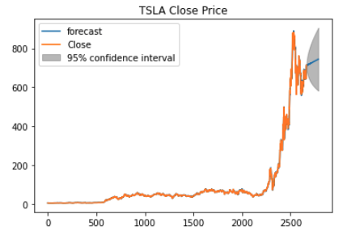

# Project 3 - Which Stock/Crypto Should I Buy?

        The objective of the project is to use different machine learning models to understand which model gives us the prediction closest to the actual. Additionally, it also forecasts the future return of a stock & crypto based on their past returns and other indicators.

        The goal of this project is to assist investors in choosing the right stock or crypto with the highest return while using the most informative indicators and the predictions made by the models; while strictly considering the client's risk tolerance.

## Project Overview

    ·   Got S&P 500 stock tickers from Wikipedia by web-scraping, then we used Yahoo Finance to get historical data for both stocks and crypto. Soon after, we cleaned the data and streamlined for further analysis

    ·   Studied results of various Machine Learning Algorithms to determine which model can be used to predict the most accurate future stock_price of a stock and cryptocurrency. Then we made a decision on which stock/crypto to buy based on these results and other indicators

    ·   Input all the result data into AWS, with help of AWS we created a Robo-Advisor to advise investors on the stocks and crypto that are ideal for their investment needs

## Data Cleanup

        We picked all the companies listed on S&P 500 based on Wikipedia. These stocks were then filtered to find the Top-20 using their market capitalization (It allows investors to size up a company based on how valuable the public perceives it to be). We further reduced the number of stocks to Top-5 by applying Sharpe Ratio.

 

        Three cryptocurrencies (Bitcoin, Ethereum and Dogecoin) were chosen based on their popularity. Yahoo finance was used to obtain both the stocks and cryptocurrencies historical data.

## Model Signals, Return and Risk

        Once we were done cleaning the data, the first analysis that was performed was on risk and return of the stocks and crypto.
 

        Next, we used Bollinger bands to determine buy or sell signals for the stocks and crypto respectively. This was done by initially calculating the rolling mean and standard deviation of each stock and crypto to determine the upper and lower bands which will eventually be used to define the buy or sell signals.

        From the graph below, Paypal(PYPL) has a buy signal on its closing price while Tesla(TSLA) has a sell signal.

  
  
  

## Model Evaluation and Prediction

To predict and forecast the close price and percentage change (pct_change) of stocks and crypto, we tested our model with 4 machine learning Algorithm which are

        1. Linear Regression

        Before we fit our data into the model to forecast the close price, we first converted them to numpy arrays as sklearn only accepts numpy array or sparse matrix. After that, we split our dataset to train and test data to derive a better evaluation on the out of sample data. It is important to note that for the pct_change, we used monthly pct_change to enable us to have a smoother analysis with less noise.

        Once completed, we were able to build our model and then forecast the prices. To test the accuracy of our forecast/result, we computed RMSE for each ticker 
   

        2.  ARIMA

        Here, we implemented a grid search to identify optimum parameters (p,d,q) that produce the best fit model for our data after which we built the model, enforce stationarity on the data, validate and visualize model performance. It is important to know that we used the parameters with the lowest AIC to forecast the future values.
        To test the accuracy of our forecast/result, we computed RMSE  for each ticker
   

        3.  LSTM

        For this, we built our LSTM neural network using Karas, fit the model , ran 10 epochs with a batch size of 200 and evaluated the model’s performance

        To test the accuracy of our forecast/result, we computed RMSE  
  
  

## Results

        At the end of the evaluation of all the machine learning algorithms and comparing the RSME of each model, we came to the conclusion that LSTM has the best model to predict and forecast price of stocks or crypto since it has the lowest RSME score for TSLA(0.235) and DOGE(0.838).

        We went further to create a robo advisor to extract the relevant data from our analysis and present responds to investors on the investments (ie stocks or crypto) that can generate the highest return while considering their risk tolerance.

 
